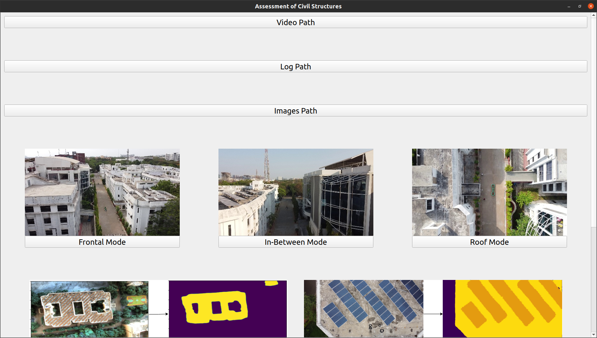
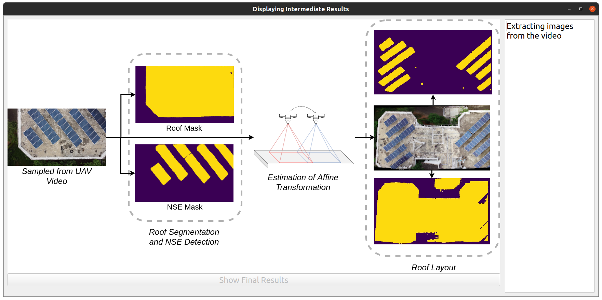

Instructions
============

    
This page covers the instructions as to how to use the software. It is assumed that the user has followed the 
instructions mentioned on the :doc:`previous page <installation>` and has successfully installed the software.
We make use of a GUI Application to run the software. :numref:`gui` shows the layout of the GUI.

.. _gui:

    GUI of the software

The user needs to select the video file and the log file to be processed by clicking on the 
*Video Path* and *Log File* options and then navigating to the respective files. In case of Roof Area Estimation,
user needs to select the directory that contains all the test images by using the *Images path* option.

.. note::

   The video should be collected as per the instructions mentioned in the :doc:`Data Collection <dataCollection>` 
   section. The log file formats have been described in the individual module sections. 

Once the video file is selected, the user needs to select the module to be used for processing the video. We have
made provisions to display significant intermediate results of the implemented algorithms (refer :numref:`intermediateresults`).
After all the intermediate results have been displayed, the user can click on *Final Results* option to see the final results.
Parallely, logs will be displayed to keep the user aware of the progress.

.. _intermediateresults:

    Displaying the architecture of the  Roof Layout Estimation module. The display will be refreshed with the latest intermediate result. 

Video and Log File Formats
----------------------------

* **Distance between Adajacent Buildings**: The log file should be of DJI log format. A sample log can be found `here <https://docs.google.com/spreadsheets/d/1S4T-xyDOT8UtDPjyFi-bwmpzHDkqjiNp/edit?usp=sharing&ouid=100052733914035235125&rtpof=true&sd=true>`_. The corresponding video should be collected as per the instructions mentioned in :doc:`dataCollection`.
* **Roof Area Estimation**: A sample log file has been provided `here <https://docs.google.com/spreadsheets/d/1BtMTbdWcIWz-nNOivYxIkYNkjrjEFxJ3s9H2-Lv8qi8/edit?usp=sharing>`_. The corresponding images should be collected as per the instructions mentioned in :doc:`dataCollection`.
* **Roof Layout Estimation**: This module does not require any log file. The corresponding video should be collected as per the instructions mentioned in :doc:`dataCollection`.