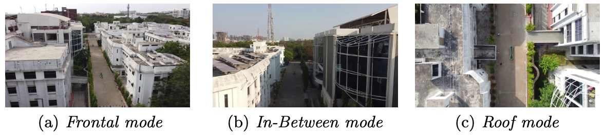

Data Collection
=======================

When it comes to automating the process, data plays the vital. Hence, this page describes about data, and its collection techniques.
We used DJI Mavic Mini drone for collecting the various data to conduct the research experiments.

Distance Between Adjacent Buildings
-------------------------------------

For estimating the distance between adjacent structures, the images are collected in 3 different modes: Frontal Mode, In-Between Mode and Roof Mode.

Fig.(a) shows the frontal face of the two adjacent buildings for which data was collected. In this mode, we focused on estimating the distance between the two buildings by analyzing only their frontal faces while flying a drone with a forward-facing camera. This view is particularly helpful when there are impediments between the subject buildings and flying a UAV between them is challenging.

Fig.(b) shows that the UAV was flown in-between the two buildings along a path parallel to the facade with a forward-facing camera. This mode enables the operators to calculate distances when buildings have irregular shapes. 

Fig.(c) shows the roof mode, where UAV was flown at a fixed altitude with a downward-facing camera so as to capture the rooftops of the subject buildings. The roof mode helps in tackling occlusions due to vegetation and other physical structures.

.. raw:: html
   <iframe width="560" height="315" src="https://www.youtube.com/embed/8Z18p_jvuFQ" title="YouTube video player" frameborder="0" allow="accelerometer; autoplay; clipboard-write; encrypted-media; gyroscope; picture-in-picture" allowfullscreen></iframe>
Plan Shape and Roof Area Estimation
-------------------------------------
For estimating the plan shape and roof area, the drone was flown with the downward-facing camera over the roof, at constant height.

Roof Layout Estimation
-------------------------------------
For estimating the plan shape and roof area, the drone was flown with the downward-facing camera over the roof, at constant height.
