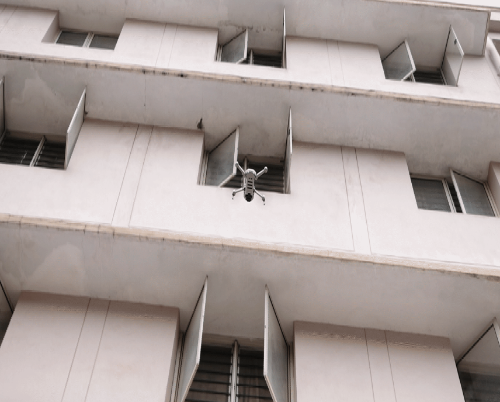

DRONE BASED INFRASTRUCTURE ASSESSMENT
=======================================

The world in which we currently live is well equipped with a variety of conventional methods for analysing 
and assessing the geometry and state of civil structures. Buildings that don't conform to seismic structural 
requirements run the risk of imposing serious damages. The vulnerability of a building to earthquake can be
assessed through inspection that takes into account the expected damage progression of the associated 
component and the component’s contribution to structural system performance. Currently, buildings and other
civil structures inspections are done manually in accordance with different set of norms. Such inspections 
may be expensive, risky, labor-intensive and resource-intensive, and time-consuming. Hence, this project named,
**DRONE BASED INFRASTRUCTURE INSPECTION** proposes different methods that automate these inspections through 
UAV-based image data collection and a software library for post-processing that helps in estimating structural
parameters.

Check out the :doc:`dataCollection` section for further information on how to collect the data, including
how to use the project by following :doc:`instructions` of the project.

.. note::

   This project is under active development.

Contents
--------

.. toctree::
   :maxdepth: 2

   dataCollection
   instructions
   modules
   installation
   publications

Project Members
-----------------
* Kushagra Srivastava
* Dhruv Patel
* Aditya Kumar Jha
* Mohhit Kumar Jha
* Jaskirat Singh
* Charvi Mendiratta
* Jaykant Kumar

Supervisors
-------------
* Dr Ravi Kiran Sarvadevabhatla
* Dr Harikumar Kandath
* Prof Pradeep Kumar Ramancharla
* Prof K Madhava Krishna