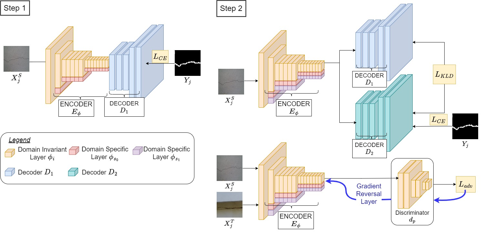

Modules
=========

This page describes the implementation methods of all the modules in detail and results of 
the CBRI and IIIT Hyderabad dataset.

1. Distance Between Adjacent Buildings
----------------------------------------

Our approach to determining the distance between adjacent buildings involves a comprehensive 
three-stage process, aimed at achieving accuracy and reliability. Here's a breakdown of our methodology:

**Stage I: Panoptic Segmentation**

We start by sampling images from UAV-captured videos and employing advanced panoptic segmentation 
techniques. This process effectively eliminates vegetation and trees surrounding the buildings, 
enhancing the precision of our measurements. See above Fig. for a visual representation of the impact of 
panoptic segmentation in frontal mode.

**Stage II: Mask Generation and 3D Reconstruction**

In this stage, masked images are generated from the binary masks obtained in Stage I. These masked 
images serve as inputs to a cutting-edge image-based 3D reconstruction library (Colmap). Through 
Structure-from-Motion techniques, this library produces a dense 3D point cloud along with camera poses.
This stage remains consistent across all three modes of operation.

**Stage III: Plane Extraction**

The final stage involves extracting planes from the obtained point cloud to identify essential structures
like roofs and walls. This stage is divided into two parts:

- Isolation of different building clusters using euclidean clustering.
- Finding planes within each cluster.

For instance, in Roof Mode, clusters are distributed on either side of the Y-axis. In-Between and Frontal 
modes witness clustering about the Z-axis. To extract the planes of interest, each cluster is sliced along
a direction parallel to the plane of interest. This slicing yields small segments of 3D points. The Random
Sample Consensus (RANSAC) algorithm is then applied to iteratively fit planes for each segment, resulting 
in a set of parallel planes.

Our approach selects a plane from the estimated set for each building based on the highest number of inliers.
Additionally, points are sampled on these planes to calculate the distance between adjacent buildings at 
various locations.

**Scale Estimation and Final Distance Calculation**

To determine the actual distance between adjacent buildings, we utilize odometry data obtained from the UAV.
By time-syncing flight logs containing GPS, Barometer, and IMU readings with sampled images, we accurately 
scale the estimated distances.

This approach ensures precise and reliable measurements, crucial for various applications such 
as urban planning, infrastructure assessment, and more. 

Below are the results of the module on the CBRI (Structural Engineering Department) and 
IIIT (Hyderabad Research Street). 

Distances calculated for Buildings 1 and 2, and Building 3 as per our method and
Google Earth along with Ground Truth measured using a ToF sensor; Our method performs 
with an **average error of 0.96%** compared to **Google Earth’s 1.36%**.

2. Plan Shape and Roof Area Estimation
----------------------------------------
This module focuses on estimating the layout and area of rooftops using a dataset collected 
from various buildings. The process involves semantic segmentation techniques for precise identification
of roof shapes and dimensions. Let's delve into the details of our approach:

**Data Collection and Pre-processing**

The data collected for rooftop, serves as the foundation for estimating roof layouts and areas. Wide-angle
images of rooftops are pre-processed to remove distortion, and histogram equalization techniques are applied 
to enhance image contrast.

**Semantic Segmentation with LEDNet**

For roof segmentation, we employ the state-of-the-art semantic segmentation model, LEDNet. Its asymmetrical
architecture reduces network parameters, enabling faster inference. Key features like split and shuffle 
operations in the residual layer and decoder's attention mechanism enhance information sharing and reduce 
network complexity.

**Data Augmentation and Inference**

During inference, data augmentation techniques such as four rotations of 90°, horizontal flip, and vertical flip
are applied to improve the network's performance and increase robustness. The output of the segmentation model is a
single-channel grayscale image, which is thresholded to obtain a binary mask representing the roof area.

**Roof Area Estimation**

The roof area is calculated using Equation 1:

.. math::

    \text{Area} (\text{m}^2) = C \times \left(\frac{D}{f}\right)^2

Where:

- C is the contour area obtained from the segmented mask (in pixels^2).
- D is the depth of the roof from the camera (in meters).
- f is the focal length of the camera (in pixels).

This formula allows us to accurately estimate the roof area based on the segmented masks and camera parameters.

Below are the results of the Roof Segmentation for 4 buildings.

Roof Area Estimation Results

.. .. _intermediateresults_all4:
.. .. figure:: images/roof_area_segment.png
..     :align: center
..     :height: 315
..     :width: 560
..     :figclass: w
..     :alt: intermediateresults

.. .. _intermediateresults_all5:
.. .. figure:: images/roof_area_result.png
..     :align: center
..     :height: 315
..     :width: 560
..     :figclass: w
..     :alt: intermediateresults

3. Roof Layout Estimation
---------------------------
This module is dedicated to estimating the layout of rooftops based on collected data, 
as detailed in previous section. Here's an overview of our approach:

**Data Collection**

Images for roof layout estimation were sampled at a frequency of 10Hz, while the corresponding 
video was sampled at 1Hz, resulting in sampled images. This dataset forms the basis for our analysis.

**Image Stitching and Mask Generation**

Image stitching techniques are applied to combine multiple images into a panoramic view, providing a
comprehensive overview of the rooftops. The results of image stitching are showcased in below figure.
Subsequently, a roof mask and a Non-Structural Element (NSE) mask are generated.

**Percentage Occupancy Calculation**

To quantify the occupancy of non-structural elements on the rooftops, the percentage occupancy is calculated.
This is achieved by taking the ratio of the area occupied by non-structural elements (in pixels^2) in the NSE
mask to the total area of the rooftops (in pixels^2) in the roof mask.

.. .. _intermediateresults_all6:
.. .. figure:: images/roof_area_result.png
..     :align: center
..     :height: 315
..     :width: 560
..     :figclass: w
..     :alt: intermediateresults

4. Crack Detection 
---------------------

Crack segmentation is paramount for ensuring the structural integrity and seismic safety of civil structures.
However, existing algorithms face challenges in maintaining accuracy across different datasets due to domain shifts.
In this module, we propose a novel deep learning approach that combines incremental training with unsupervised domain
adaptation (UDA) using adversarial learning. Our method achieves significant improvements in crack segmentation 
accuracy and generalization across target domains compared to existing UDA methods.

**Framework (CrackUDA)**

We introduce CrackUDA, a two-step unsupervised domain adaptation approach for binary segmentation of 
cracks. The model comprises an encoder​, two domain-specific decoders and a discriminator network 
acting as a domain classifier. The encoder consists of shared domain-invariant parameters and 
domain-specific parameters exclusive to respective domains.

In the first step, a binary segmentation model is trained on the source dataset using decoder and 
encoder, which consists of shared domain-invariant parameters and domain-specific parameters exclusive
to the source domain.

In the second step, new domain-specific parameters are introduced to a new encoder along with 
domain-specific decoder, forming model​. An alternating training strategy is employed, where model undergoes
binary segmentation training followed by adversarial training through the discriminator​.

This approach facilitates adaptation to target domains without a notable decrease in performance on 
the source domain, making it a powerful tool for crack segmentation tasks.

Below are the crack segmentation results on the CBRI and IIIT Hyderabad dataset : 

5. Window Detection and Storey Count  
-----------------------------------------

This module provides insights into the architectural features of the buildings and give storey count through window detection.
Upon model inference, as demonstrated in the block diagram, the Shufflenet model within existing win_det_heatmaps effectively 
detects windows. However, it's not uncommon for some windows to remain undetected. To address this issue, we've developed a 
sophisticated post-processing module.

The Post-processing module is designed to refine the results further. It takes the detected windows as templates and 
systematically examines the horizontal patch within the image. By matching these templates with the patch, it identifies 
and detects any windows that may have been missed during the initial detection phase. This ensures a comprehensive and 
accurate assessment of the building's window and storey count, enhancing the overall reliability of our system.

Below are some results of the window detection and storey count on IIIT Hyderabad dataset.

6. Storey Height Estimation 
-------------------------------

As shown in the block diagram above, we make use of Depth(D), focal length of the camera(f), height of the UAV(H) and image
coordinates(x,y) are used to map the coordinates of each detected window from the image to a 2D vertical plane using
triangulation. 

.. image:: images/storey_nms.png
    :alt: window result

The above vertical plane helps us get an estimate of distance between 2 consecutive vertical windows. Although we have the 
imaginary vertical plane(scaled in cm), we cannot use this directly to estimate storey heights. This is because the vertical
plane also includes the ground plane. Due to this, the estimated height increases by the proportion of ground plane pixels
and therefore it needs to be accounted for. As it depends on the start frame and also the camera’s FOV, it is difficult to 
generalize it in different scenarios, hence we rely on 3D reconstruction for this.

We use the unit scale to estimate the building/storey heights in the 3D reconstruction.

7. Building Tilt Estimation 
---------------------------------

This module is to estimate the tilt in buildings, especially in regions characterized by hilly terrain 
where buildings are often situated on slopes and also where soil settlements are common. Accurate estimation 
of building tilt not only aids in architectural planning and construction but also contributes to safety 
assessments and disaster mitigation efforts.

For this module we collected data with customized drone setup equipped with a ZED camera and 2D lidar mounted on it,
providing us with the necessary data acquisition capabilities. as shown in the image below. 

For the proof of concept phase, we conducted data collection exercises at IIIT Hyderabad, Felicity Ground. Using our setup,
we performed two distinct methods to determine the slope of the terrain with reference to the ground, particularly near 
building walls at intersections.

The first method utilizes sensor-based calculations, where we leverage data from RTK GPS and 2D lidar to measure distances 
and heights, respectively. Below are the results of Felicity Ground. 

In contrast, second approach employs deep learning techniques. As shown in below block diagram, we reconstruct 3D models of 
sloping surfaces, conduct plane segmentation to identify the ground plane and adjacent walls, and subsequently determine 
the normal vectors of these segments for tilt estimation.

Below are the results of Felicity Ground, using above approach. 

Through this, we aim to provide efficient solutions for assessing building tilt, enabling better management and planning,
especially in regions prone to uneven terrain.

**Note :** This module is in progress. 

